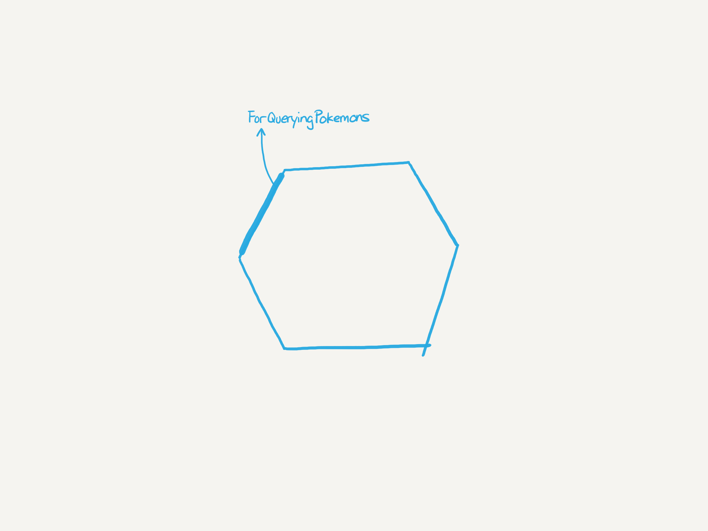
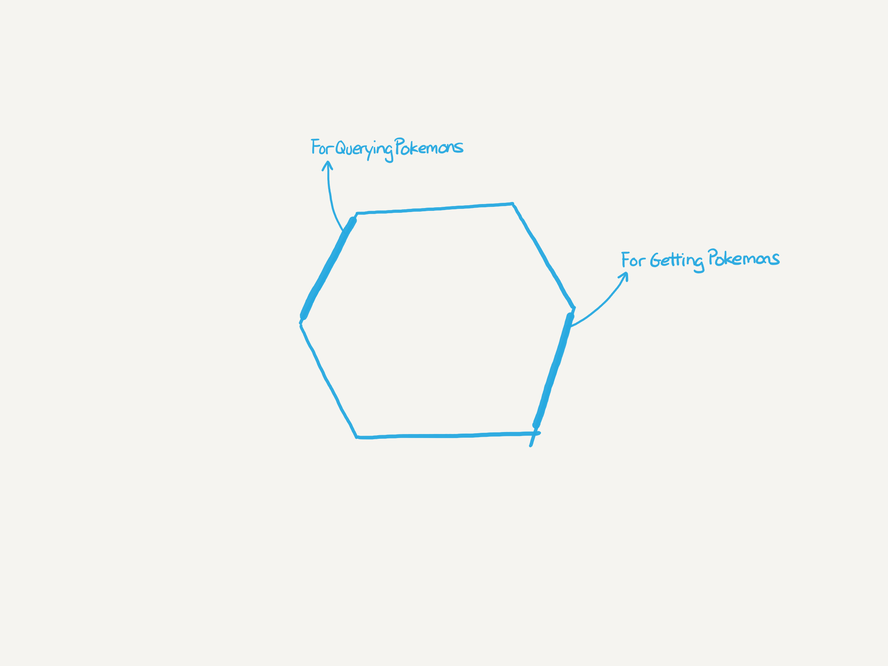
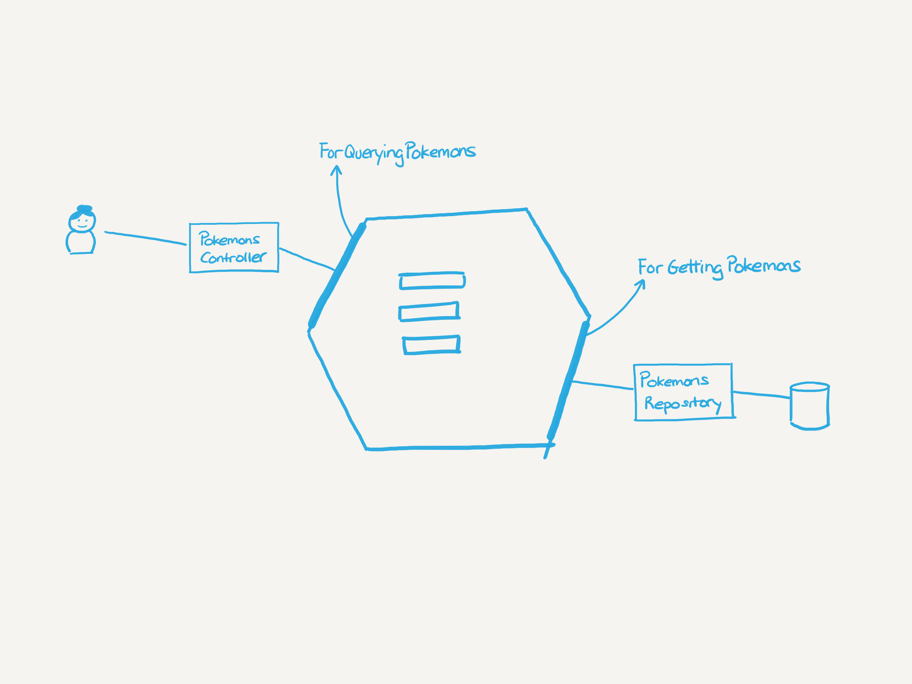
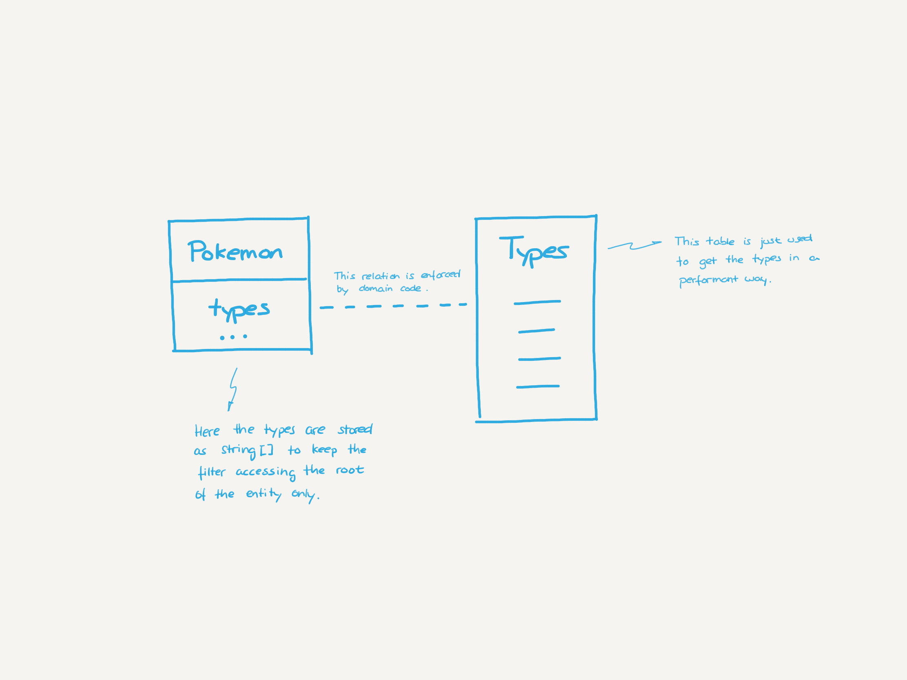
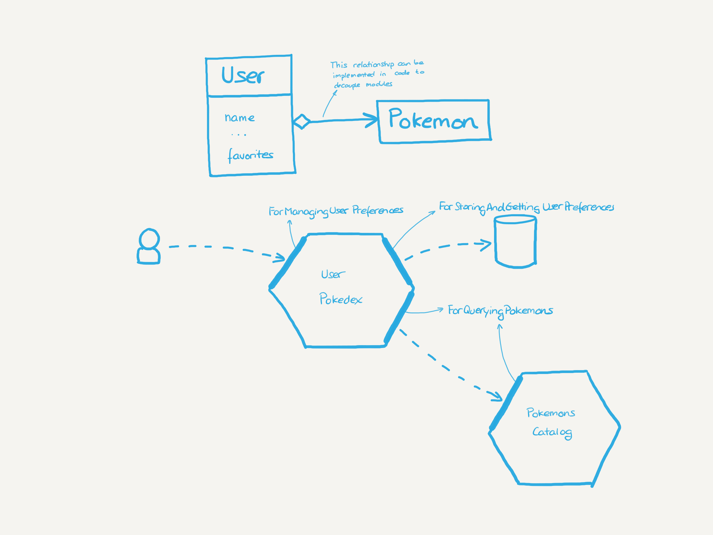
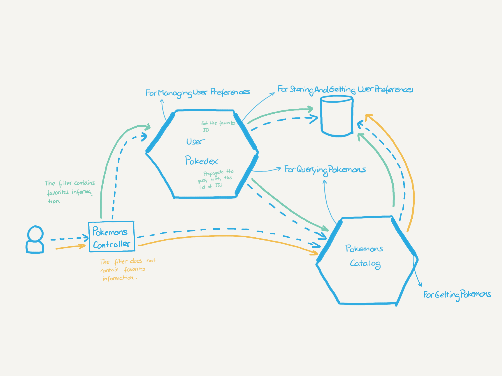
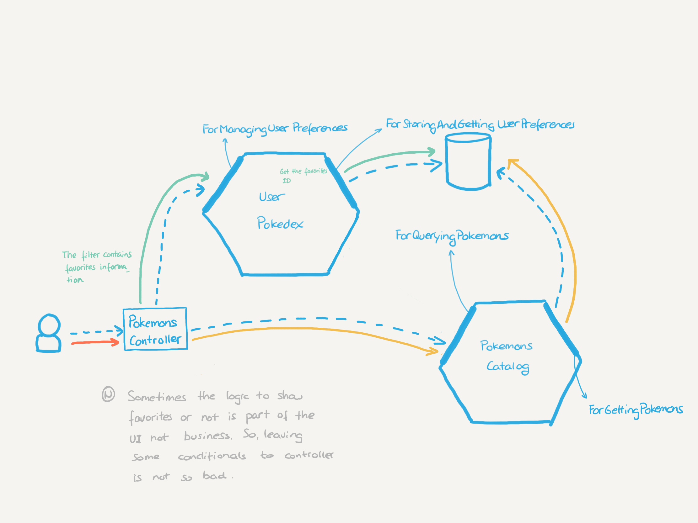

# Development notes

The idea is to implement the [IBM Quantum backend code challenge](https://github.com/IBMQuantum/backend-code-challenge).

Doing this coding practice the goals are:
* Using Hexagonal Architecture new insights.
* Using TDD or ATDD.
* Decomposing "stories" into thin vertical slices.

## Requirements

The instructions don't define user stories, so we will just write down the requirements given.

* Query Pokemons by type.
* Query favorite Pokemons.
* Query Pokemons paginated.
* Get a Pokemon by its ID.
* Get a Pokemon by its name.
* Get the types of Pokemons as a list.
* Mark (or unmark) a Pokemon as favorite.

## Step by step development

My first step will be to check the requirements, removing duplicated functionality and organizing (sorting) them to make the development process simpler.

- [x] Get a Pokemon by its ID.
- [x] Get a Pokemon by its name.
- [x] Query Pokemons paginated.
- [x] Query Pokemons by type.
- [x] Mark (or unmark) a Pokemon as favorite.
- [x] Query favorite Pokemons.
- [ ] Get the types of Pokemons as a list.

### Get a Pokemon by its ID

Probably the easiest one to start with, and define the first port of the Hexagonal Architecture.



The first step is to create a test that forces the creation of the port interface and a basic implementation of the Pokemon Catalog, returning hardcoded values.

```typescript
describe('A Pokemon Catalog', () => {
  it('Gets a pokemon given its ID', () => {
    const pokemonCatalog: ForQueryingPokemons = new PokemonCatalog();
    expect(pokemonCatalog.getPokemonByItsID('025')).toStrictEqual(pikachu);
  });
});
```

Some changes from the original data were applied:
1. Because the ID of a Pokemon is a string, at the `evolution` field `id` is transformed into string.
2. The height and weight of a Pokemon is returned with the unit separated from the value, so it can change in the future.

Once we have the driver port, we will create a driven port that will match with the repository, using a second test.



Once we have the second port, we already defined the hexagon, and we can delete the previous test because it makes no sense anymore, and it is not giving any value.

```typescript
describe('A Pokemon Catalog', () => {
  const raichu = MockedPokemons.raichu();
    
  it('Gets a pokemon given its ID using a port mocked adapter', () => {
    const mockedPokemonsRepository = mock<ForGettingPokemons>();
    const pokemonCatalog: ForQueryingPokemons = new PokemonCatalog(
      mockedPokemonsRepository,
    );

    mockedPokemonsRepository.getPokemonById
      .calledWith('026')
      .mockReturnValue(raichu);

    expect(pokemonCatalog.getPokemonByItsID('026')).toStrictEqual(raichu);
  });
});
```

At this point we solved all the required scaffolding, and we created the ports interfaces. Now we need to create the REST endpoint and test with an e2e test that all is working properly using actual adapters.



```typescript
describe('AppController (e2e)', () => {
  let app: INestApplication;

  beforeEach(async () => {
    const moduleFixture: TestingModule = await Test.createTestingModule({
      imports: [AppModule],
    }).compile();

    app = moduleFixture.createNestApplication();
    await app.init();
  });

  it('should support requesting a pokemon by its ID', async () => {
    const response = await request(app.getHttpServer())
      .get('/pokemons/025')
      .expect(200);

    expect(response.body).toStrictEqual(MockedPokemons.pikachuView());
  });
});
```

At thins point, the feature is complete using an in memory implementation for the persistence.

### Get a Pokemon by its name

With all the scaffolding created to complete the hexagon code now is pretty simple. We create a new test and make it pass.

```typescript
it('Gets a pokemon given its name using a port mocked adapter', () => {
  const mockedPokemonsRepository = mock<ForGettingPokemons>();
  const pokemonCatalog: ForQueryingPokemons = new PokemonCatalog(mockedPokemonsRepository);

  mockedPokemonsRepository.getPokemonByName.calledWith('venusaur').mockReturnValue(venusaur);

  expect(pokemonCatalog.getPokemonByItsName('venusaur')).toStrictEqual(venusaur);
});
```

To complete the implementation we just need to create the e2e test and writing the required production code that will be fairly simple.

```typescript
it('should support requesting a pokemon by its name', async () => {
  const response = await request(app.getHttpServer())
    .get('/pokemons/name/charizard')
    .expect(200);

  expect(response.body).toStrictEqual(MockedPokemons.charizardView());
});
```

**One of the things noticed at this step is the existence of a property called `Previous evolution(s)` which is not a good option if we want to use JSON. To keep the specification as given, we can do the transformation at the controller level, but internally it will be `previousEvolutions`.**

### Query Pokemons paginated

Up to this point we used a fake implementation (in-memory) as the pokemons repository. Because now we are going to use pagination it makes sense to start using the tools provided by Nest.js and TypeORM, but this step requires some previous work.

- [x] Start a PostgreSQL instance with Docker.
- [x] Create the TypeORM entity that maps to the DB.
- [x] Fill the DB with data to complete e2e tests.

This was a refactor that took some time, specially because the dump from the DB matches well with MongoDB but not so well with a relational DB. The good news are that we can use the tools from Nets.js and TypeORM to implement the pagination.

The first step is to create the domain code, so we write a test and the code to leave the test in green.

```typescript
it('Gets a page of pokemons using a port mocked adapter', async () => {
  const mockedPokemonsRepository = mock<ForGettingPokemons>();
  const pokemonCatalog: ForQueryingPokemons = new PokemonCatalog(mockedPokemonsRepository);

  mockedPokemonsRepository.findPokemons.calledWith(1, 2).mockResolvedValue([raichu, venusaur]);

  expect(await pokemonCatalog.getPageOfPokemons(1, 2)).toStrictEqual([raichu, venusaur]);
});
```

And also the e2e test code. In this case we will use a snapshot because the query implemented by TypeORM (and the object recomposition) affects to the order of some internal properties, e.g. the sorting for weaknesses changes between the object to test against and the actual object.

```typescript
it('should support requesting a page of pokemons (default order is by ID)', async () => {
  const response = await request(app.getHttpServer()).get('/pokemons?page=2&size=3').expect(200);

  // Used snapshot after checking the data is valid, because the order of some inner collections changes with the
  // DB query
  expect(response.body).toMatchSnapshot();
});
```

At this point we will get rid of `in-memory-pokemon-repository.ts` because it gives no value anymore.

### Query Pokemons paginated v2

As in real life, you can check with the frontend team to decide if the endpoints are useful for them or not. In this case we can introduce a new set of restrictions:
* The arguments to select the page are `skip` and `limit`.
* The response is an object `{ items: ..., meta: ... }` where meta contains the information of `skip`, `limit`, and `count`.

Given this requirements, the hexagon requires a new feature that returns the count of elements given a filter. As always we start with a test and continue implementing the code.

```typescript
it('Gets the total amount of elements in a query', async () => {
  const mockedPokemonsRepository = mock<ForGettingPokemons>();
  const pokemonCatalog: ForQueryingPokemons = new PokemonCatalog(mockedPokemonsRepository);

  mockedPokemonsRepository.countPokemons.calledWith().mockResolvedValue(4);

  expect(await pokemonCatalog.getNumberOfPokemons()).toBe(4);
});
```

For an e2e test we just need to validate the data and update the snapshot with `--updateSnapshot` option.

### Query Pokemons by type

This feature requires to modify the resource `GET /pokemons` adding the option to specify a `type` query parameter.

First we will modify the hexagon methods to accept that change.

```typescript
it('Gets a page of pokemons filtered by type using a port mocked adapter', async () => {
  const mockedPokemonsRepository = mock<ForGettingPokemons>();
  const pokemonCatalog: ForQueryingPokemons = new PokemonCatalog(mockedPokemonsRepository);
  const filter: PokemonsQueryFilter = {
    type: 'aType',
  };

  mockedPokemonsRepository.findPokemons.calledWith(1, 1, filter).mockResolvedValue([raichu]);

  expect(await pokemonCatalog.getPageOfPokemons(1, 1, filter)).toStrictEqual([raichu]);
});
```

But the filter should be used also to count the number of pokemons:

```typescript
it('Gets the total amount of elements in a filtered query using a port mocked adapter', async () => {
  const mockedPokemonsRepository = mock<ForGettingPokemons>();
  const pokemonCatalog: ForQueryingPokemons = new PokemonCatalog(mockedPokemonsRepository);
  const filter: PokemonsQueryFilter = {
    type: 'aType',
  };

  mockedPokemonsRepository.countPokemons.calledWith(filter).mockResolvedValue(4);

  expect(await pokemonCatalog.getNumberOfPokemons(filter)).toBe(4);
});
```

At this point we just need to connect with the controller and the DB repository implementation using an e2e test to do that.

```typescript
it('should support requesting a page of pokemons filtered by type (default order is by ID)', async () => {
  const response = await request(app.getHttpServer()).get('/pokemons?limit=3&type=Fire').expect(200);

  expect(response.body).toMatchSnapshot();
});
```

One problem at this point is how to store the types and query them to make it as performant as possible, but keeping the implementation time as short as possible.



Having a separate table for `Types` and storing the pokemon's types as an array at the same table is a good balance between performance and simplicity.

### Mark (or unmark) a Pokemon as favorite

At this point we start working with a new entity `User` and that opens the gates to hundreds of different solutions. The idea here is to create a second hexagon that handles all the logic related to a user.



After the hexagon implementation is complete, we have the connect with the controller and actual repository implementation, which could require extra endpoints to validate the right behaviour like getting the user preferences. That forces us to add more functions to the `ForManagingUserPreferences` port but it should not take too much time.

### Query favorite pokemons



This requires some changes to the existing code, to make things simpler and using an iterative development we can make thiner slices:

- [x] The pokemon catalog accepts a filter that is an array of IDs.
- [ ] The user pokedex allows to search using the same search criteria than pokemon catalog.
- [ ] The user pokedex allows to count with the same search criteria than pokemon catalog.
- [ ] The pokemon controller allows to include favorites as a search criteria and decides which hexagon to use.

After starting to implement the proposed concept I change my mind. Paper is much more supportive than actual code, so there are simpler options that in this case could make things simpler and more maintainable than a strict hexagonal architecture approach.



### Get the types of pokemons as a list

After all the work completed it should be a pretty simple implementation.

- [ ] Pokemons Catalog returns the types of pokemons.
- [ ] A controller allows to the get types as a list.
- [ ] Implement the repository to get the actual list of types.

## Things to improve

* The expects using the snapshots are not good as long as the ordering of some subdocuments from the JSON can change depending on the DB and loading process. Creating a custom matcher is time consuming for a code challenge.